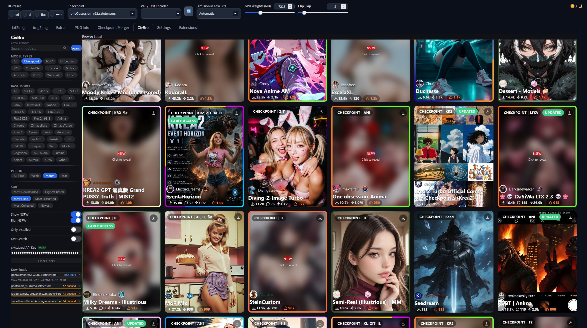
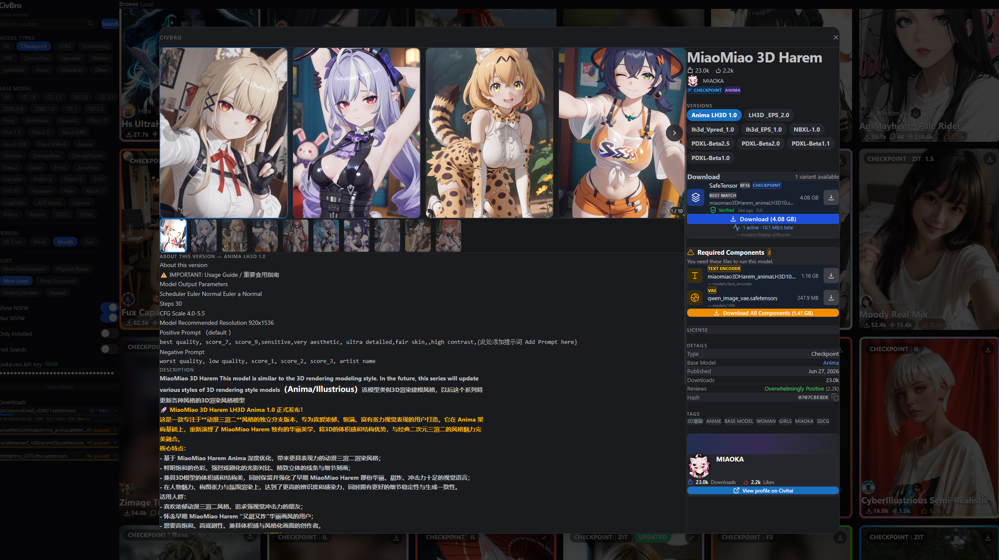
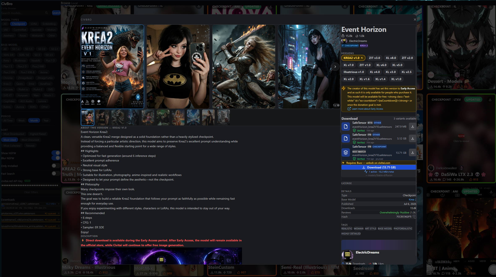

# CivBro — Civitai Model Browser for Stable Diffusion WebUI

**CivBro** is an extension for **Stable Diffusion WebUI** (Gradio / FastAPI / WebUI Forge Classic) that brings the full Civitai browsing, filtering, and model downloading experience directly into your WebUI interface.

---

## Preview and Screenshots

### Main Model Search Grid


### Model Info & Required Components / Dependencies


### Model Info & Buzz Requirement Handling


---

## Easy Installation (No Compilation Needed)

CivBro comes pre-compiled and ready to use out of the box. You do **not** need Node.js, Rust, or build tools installed.

### Option 1: Install via WebUI Interface (Recommended)
1. Open your Stable Diffusion WebUI.
2. Go to the **Extensions** tab.
3. Click on the **Install from URL** sub-tab.
4. Paste the repository URL into **URL for extension's git repository**:
   ```text
   https://github.com/empulse75/CivBro
   ```
5. Click **Install**.
6. Go to the **Installed** tab and click **Apply and restart UI** (or restart your WebUI process).

### Option 2: Install via Git Clone
Clone this repository directly into your WebUI extensions folder:

```bash
cd /path/to/sd-webui/extensions
git clone https://github.com/empulse75/CivBro
```

Restart your WebUI.

---

## Features

- **Native WebUI Tab Integration:** Renders seamlessly as an embedded tab inside Gradio.
- **Civitai Search Parity:** Search checkpoints, LoRAs, VAEs, ControlNets, Text Encoders, embeddings, and upscalers with base-model filtering (SD 1.5, SDXL, Pony, Flux, etc.). Filters change without triggering search — explicit Search button required.
- **Model Card Cosmetics & Decorations:**
  - Creator **cosmetic gradient frames & glow effects** matching Civitai's 8px radius / 6px visual border.
  - Creator **avatar decorations** and **trophy badges**.
  - Custom styled **nameplates** and multi-model family badges with short codes (IL, XL, Pony, F1, etc.).
- **Reactive Browse Filters:** "Early Access", "Updated Last 48h", NSFW, and "Only Installed" filter retained search results immediately, including models enriched asynchronously by tRPC.
- **NSFW Control:** Toggle hides NSFW-flagged models completely from the grid (not just blur).
- **Smart Buzz-Aware Downloads:** Lock icon on unpurchased buzz models (opens civitai.com); tracks purchased models across sessions.
- **Generation-Only Detection:** Popup warns when a model has no downloadable checkpoint files.
- **Fast & Unblocked:** Uses batched tRPC `model.getById` enrichment for card extras, bypassing rate limits.
- **One-Click Downloading:** Automatically places downloaded files into the correct model folder (`Stable-diffusion/`, `Lora/`, `VAE/`, `embeddings/`, `ControlNet/`, `text_encoder/`).
- **Disk Sidecars:** Generates `.civitai.info` metadata and preview images next to every downloaded model.
- **Popup Animations:** Scale+fade entrance, backdrop fade-in, skeleton loading, version-switch transitions.

---

## Architecture

- **Backend:** Modular FastAPI app (17 Python modules) mounted under `/civbro/api`. HTTP I/O only — all CPU-bound work (parsing, hashing, CSS validation, URL rewriting) lives in Rust.
- **Rust Core:** High-performance PyO3 module (`civbro_core.so`) — 5 parse sub-modules, Ed25519 license signature verification, SQLite FTS5 database, SHA-256/BLAKE3 file hashing, directory scanning, orphan `.part` cleanup. No Python fallbacks exist.
- **Frontend:** Svelte 5 & TailwindCSS 4 SPA with reactive state, 6-state DownloadButton component, shared Svelte actions, and CSS animations.

---

## Development Documentation

For build commands, API details, architecture decisions, and contributor guidance, see the [project README](../README.md), [ADRs](../docs/adr/), and [AGENTS.md](../AGENTS.md).
